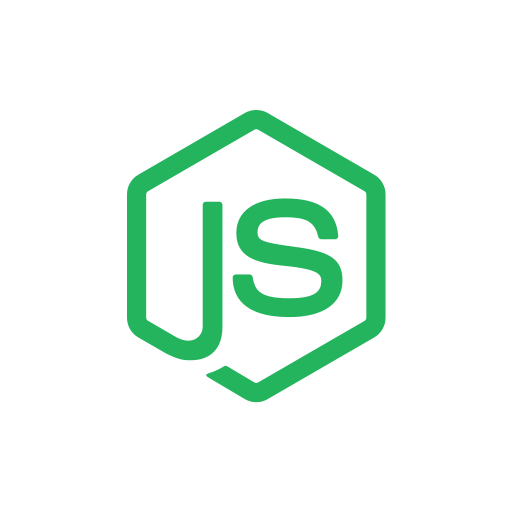

<h2 align="center" style="border-bottom: none;"> 📬 Background Jobs 📭</h1>
<h4 align="center">Node.js + Redis</h4>

<p align="center">
    
    
</p>

#### How to use

```bash
$ git clone https://github.com/PeterPimentel/background-jobs-node
$ cd background-jobs-node/
$ npm install

$ docker-compose up //Redis
$ npm run dev //API
```